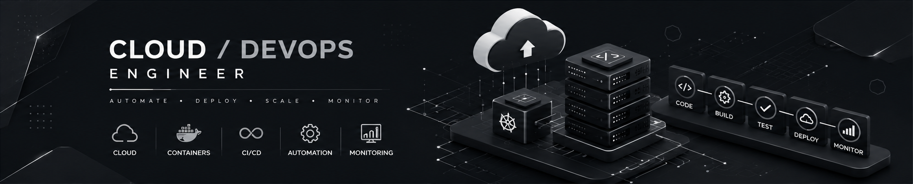

  

<h1 align="center">Hi 👋 I'm Antonis Loukis</h1>

Cloud • DevOps • Platform Engineering

Building reliable cloud infrastructure, automating deployments, and continuously learning modern DevOps practices.

---

## 📊 GitHub Statistics

<table>
<tr>
<td>

</td>

<td>

</td>
</tr>
</table>

---

##

---

## 💻 Tech Stack

---

## ☁️ Current Learning

---

## 🏆 Certifications

Coming soon...

---

## 🧪 Hands-On Labs

- Boot.dev
- KodeKloud
- Hack The Box
- TryHackMe
- LetsDefend

---

## 🚀 Featured Projects

| Project | Description |
|---------|-------------|
| Cloud Infrastructure | Terraform + AWS |
| Kubernetes Lab | Production-like cluster |
| Docker Projects | Containers & Compose |
| GitHub Actions | CI/CD Pipelines |
| Linux Automation | Bash scripting |

---

## 📈 Contribution Graph

---

