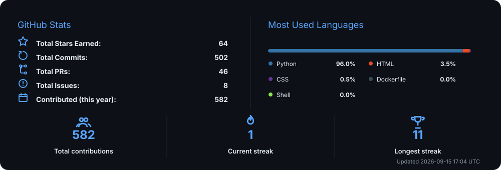

### ◇ Tech Stack

### ◈ Learning Achievements

<table>
<tr>

<td align="center" width="50%">
  
  <strong>
    &nbsp;<a href="https://www.boot.dev/u/swatsecone">Boot.dev</a>
  </strong>
    
  ▸ Backend Developer Path • <b>In Progress</b> 
  ▸ DevOps Path • <b>Planned</b>
</td>

<td align="center" width="50%">
  
  <strong>
    &nbsp;<a href="https://labex.io/u/antonis-loukis-55763425">LabEx</a>
  </strong>
    
  ▸ Linux Skill Tree • <b>Planned</b> 
  ▸ Git Skill Tree • <b>Planned</b>
</td>

</tr>
</table>

### ▣ Featured Projects

#### Applications

<table>
<tr>

<td width="50%" valign="top">

### 🚀 [Asteroids](https://github.com/antonisloukis/asteroids)

Python/Pygame implementation of the classic Asteroids arcade game.

**Stack:** Python · Pygame

  

</td>

<td width="50%" valign="top">

### 🤖 [bootdev-ai-agent](https://github.com/antonisloukis/bootdev-ai-agent)

A Python AI coding agent with tool calling, safe file operations, and multi-step agent loops.

**Stack:** Python · LLM-agent

  

</td>

</tr>

<tr>

<td colspan="2" width="100%" valign="top">

### 📊 [Minimal GitHub Stats](https://github.com/antonisloukis/minimal-github-stats)

Minimal, customizable GitHub profile statistics generated automatically with Python and GitHub Actions.

**Stack:** Python · GitHub Actions · GraphQL · SVG

  

</td>

</tr>
</table>

### ◫ Development Metrics

  

