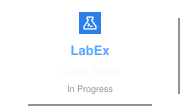
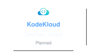
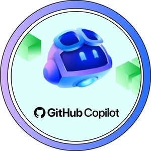
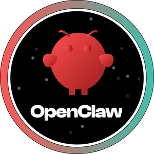

### ◇ Tech Stack

  

### ◈ Learning & Achievements

 

&nbsp;
&nbsp;
&nbsp;
&nbsp;
&nbsp;

### ▣ Featured Projects

#### Applications

<table width="100%">

<tbody>
<tr>

<td width="50%" valign="top">

<h3>
  
  &nbsp;<a href="https://github.com/antonisloukis/asteroids">Asteroids</a>
</h3>

Python/Pygame implementation of the classic Asteroids arcade game.

  
  
  
  

</td>

<td width="50%" valign="top">

  

  <h3>
    
    &nbsp;<a href="https://github.com/antonisloukis/answertrace">AnswerTrace</a>
  </h3>

  GitHub Discussions contribution analytics and customizable SVG widgets for developer READMEs.

  

  
  
  

  

</td>

</tr>
</tbody>

<tbody>
<tr>

<td colspan="2" width="100%" valign="top">

<h3>
  
  &nbsp;<a href="https://github.com/antonisloukis/runbookproof">RunbookProof</a>
</h3>

Continuously verify commands in documentation, runbooks, and AI-generated instructions.

  
  
  
  
  
  
  

</td>

</tr>
</tbody>

</table>

### ◎ Challenges

  
  

### ◫ Development Metrics

  
  

